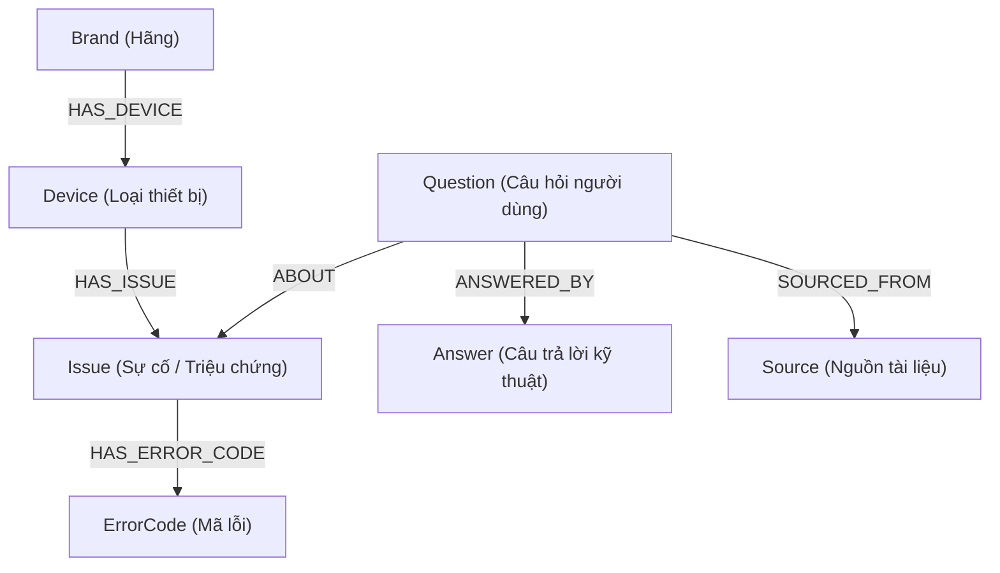

# TÀI LIỆU MÔ HÌNH DỮ LIỆU (DATA_MODEL.md)
## Hệ Thống RAG Chatbot Hỗ Trợ Sửa Chữa Thiết Bị Điện Tử

> **Ghi chú học tập**: Tài liệu này mô tả chi tiết mô hình dữ liệu thực tế được phân tích trực tiếp từ file `data/raw/dataset.xlsx`. Mục tiêu phục vụ đồ án học tập, ưu tiên tính đơn giản, tường minh và dễ giải thích trong buổi thi vấn đáp (oral examination).

---

## 1. Tổng quan bộ dữ liệu (Dataset Overview)

- **Tệp dữ liệu nguồn**: `data/raw/dataset.xlsx` (Dung lượng: ~495 KB, gồm 15 sheet).
- **Tổng số bản ghi**: **1.090 câu hỏi - đáp (Q&A)** về xử lý sự cố thiết bị điện tử gia dụng.
- **Phạm vi thương hiệu (3 hãng)**:
  1. `LG`
  2. `Panasonic`
  3. `Samsung`
- **Phạm vi thiết bị (10 loại thiết bị)**:
  - Tủ lạnh, Máy giặt, Máy sấy, Điều hòa, Lò nướng, Lò vi sóng, Máy rửa bát, Máy lọc không khí, Bếp, TV.
- **Vai trò trong hệ thống RAG**:
  - Dữ liệu cung cấp tri thức cơ sở (ground truth knowledge).
  - Không tự sinh dữ liệu giả lập (no hallucination).
  - Kết hợp hai phương thức lưu trữ bổ trợ cho nhau:
    - **ChromaDB**: Tìm kiếm ngữ nghĩa vector từ câu hỏi và nội dung khắc phục.
    - **Neo4j**: Truy vấn cấu trúc quan hệ chuẩn xác (Hãng → Thiết bị → Sự cố → Mã lỗi → Câu hỏi → Câu trả lời → Nguồn).

---

## 2. Các sheet chính và mục đích sử dụng (Main Sheets)

Bộ dữ liệu Excel được cấu trúc thành 15 sheet rõ ràng, phục vụ từng khâu trong pipeline dữ liệu:

| STT | Tên Sheet | Số dòng | Mục đích chính |
|:---:|:---|:---:|:---|
| 1 | `BỘ CÂU HỎI RAG + NEO4J` | 1.094 | Dữ liệu Q&A tổng hợp thô ban đầu, gồm câu hỏi, câu trả lời, link nguồn và chú thích. |
| 2 | `CHIA CHỦ ĐỀ` | 41 | Thống kê phân bố dữ liệu theo Hãng → Thiết bị → Loại sự cố, giúp đánh giá độ phủ tri thức. |
| 3 | `README` | 15 | Bản hướng dẫn và tóm tắt quy ước chuẩn hóa của bộ dữ liệu. |
| 4 | **`DATA_CLEAN_TECH`** | **1.091** | **Sheet kỹ thuật trung tâm (Master clean table)** chứa 1.090 bản ghi đã làm sạch với đầy đủ 24 trường dữ liệu, khóa ID và cờ chất lượng. Đây là nguồn dữ liệu trực tiếp để nạp vào ChromaDB và làm giàu node Neo4j. |
| 5 | `BRANDS` | 4 | Bảng thực thể Hãng thiết bị (3 hãng). |
| 6 | `DEVICES` | 11 | Bảng thực thể Loại thiết bị (10 loại). |
| 7 | `ISSUES` | 633 | Bảng thực thể Sự cố/Triệu chứng đã chuẩn hóa (632 sự cố). |
| 8 | `ERROR_CODES` | 333 | Bảng thực thể Mã lỗi chuẩn hóa (332 mã lỗi duy nhất). |
| 9 | `QUESTIONS` | 1.091 | Bảng thực thể Câu hỏi người dùng (1.090 câu hỏi). |
| 10 | `ANSWERS` | 1.091 | Bảng thực thể Câu trả lời kỹ thuật (1.090 câu trả lời). |
| 11 | `SOURCES` | 32 | Bảng thực thể Nguồn tài liệu tham khảo (31 link tài liệu nguồn duy nhất). |
| 12 | **`RELATIONSHIPS`** | **4.392** | Danh sách 4.391 cạnh quan hệ giữa các thực thể, dùng để nạp trực tiếp vào đồ thị Neo4j. |
| 13 | `DUPLICATES` | 119 | Thống kê 118 bản ghi thuộc 59 nhóm trùng lặp hoặc biến thể được giữ lại có chủ đích. |
| 14 | `QUALITY` | 20 | Báo cáo kiểm định chất lượng dữ liệu (số lượng mã lỗi không xác định, nguồn thứ 3, tỉ lệ phân tách nguyên nhân). |
| 15 | `NEO4J_SCHEMA` | 16 | Bản đặc tả cấu trúc node, label, relationship và hướng dẫn import đồ thị. |

---

## 3. Các trường dữ liệu chính từ `DATA_CLEAN_TECH`

Sheet `DATA_CLEAN_TECH` gồm 24 cột, được phân chia thành 4 nhóm nghiệp vụ dễ hiểu:

### 3.1. Nhóm Định danh & Câu hỏi
- **`ID`**: Khóa chính của câu hỏi kỹ thuật (`Q0001` đến `Q1090`).
- **`Nguồn_TT`**: Số thứ tự đối chiếu với bảng thu thập gốc.
- **`Câu_hỏi_gốc`**: Nội dung người dùng hỏi nguyên bản, chưa qua xử lý.
- **`Câu_hỏi_đã_làm_sạch`**: Câu hỏi đã lược bỏ ký tự gõ lỗi, dấu câu thừa, chuẩn hóa chính tả.
- **`Câu_hỏi_normalized`**: Câu hỏi chữ thường, loại bỏ khoảng trắng thừa.
- **`Question_Key`**: Chuỗi văn bản không dấu dùng để phát hiện câu hỏi trùng/biến thể.

### 3.2. Nhóm Phân loại Thiết bị & Sự cố
- **`Hãng`**: Tên thương hiệu (`LG`, `Panasonic`, `Samsung`).
- **`Cách_xác_định_hãng`**: Phương pháp suy luận hãng (`question`: xuất hiện trong câu hỏi; `source`: từ tên miền nguồn chính thức; `answer`: suy luận từ câu trả lời).
- **`Loại_thiết_bị`**: Tên thiết bị (`Tủ lạnh`, `Điều hòa`, `Máy giặt`, ...).
- **`Cách_xác_định_thiết_bị`**: Phương thức xác định (`question` hoặc `answer`).
- **`Mã_lỗi`**: Mã lỗi xuất hiện trên màn hình LED/bo mạch (ví dụ: `RS`, `CF`, `U04`, `E1`). Nếu câu hỏi về triệu chứng thuần, trường này để trống.
- **`Loại_câu_hỏi`**: Phân loại mục đích (`ERROR_CODE`, `TROUBLESHOOTING`, `CAUSE`, `GENERAL_INFO`, `ERROR_CODE_UNKNOWN`).
- **`Loại_sự_cố`**: Phân loại theo sự cố (`ERROR_CODE`, `SYMPTOM`, `ERROR_CODE_UNKNOWN`).
- **`Issue_ID`**: Mã tham chiếu tới bảng thực thể sự cố (`I0001` đến `I0632`).

### 3.3. Nhóm Câu trả lời & Cấu trúc kỹ thuật
- **`Loại_câu_trả_lời`**:
  - `CAUSE_SOLUTION` (733 bản ghi): Tách biệt rõ ràng thành nguyên nhân và cách xử lý.
  - `ANSWER` (357 bản ghi): Câu trả lời mô tả chung, không ép buộc bóc tách nếu tài liệu gốc không có nhãn.
- **`Nguyên_nhân`**: Đoạn giải thích nguyên nhân gây ra sự cố kỹ thuật.
- **`Cách_khắc_phục`**: Hướng dẫn thao tác khắc phục sự cố từng bước.
- **`Trả_lời`**: Toàn văn nội dung trả lời kỹ thuật hoàn chỉnh.

### 3.4. Nhóm Nguồn tài liệu & Cờ kiểm soát chất lượng
- **`Source_ID`**: Mã nguồn tài liệu (`S001` đến `S031`).
- **`Nguồn_URL`**: Đường dẫn trực tiếp đến trang hỗ trợ/bảo hành kỹ thuật.
- **`Domain`**: Tên miền cung cấp thông tin (ví dụ: `www.lg.com`, `www.samsung.com`, `www.dienmayxanh.com`).
- **`Duplicate_Group`**: Mã nhóm trùng lặp (ví dụ: `DUPD0D40AC0`) nếu câu hỏi là biến thể.
- **`Duplicate_Count`**: Số lượng bản ghi trong nhóm trùng lặp.
- **`Cờ_chất_lượng`**: Các tag ghi nhận đặc điểm bản ghi (`THIRD_PARTY_SOURCE`, `ANSWER_NOT_SPLIT_CAUSE_SOLUTION`, `BRAND_SOURCE`, `MULTIPLE_ERROR_CODES`, `ERROR_CODE_NOT_IDENTIFIED`, ...).

---

## 4. Ánh xạ sang ChromaDB (ChromaDB Mapping)

ChromaDB là cơ sở dữ liệu vector dùng cho **Semantic Similarity Search** (tìm kiếm tương đồng ngữ nghĩa). Dữ liệu từ `DATA_CLEAN_TECH` được chia thành `Document Content` (nội dung để tính embedding) và `Metadata` (thông tin để lọc và định danh).

### Bảng chi tiết ánh xạ ChromaDB:

| Trường Excel (`DATA_CLEAN_TECH`) | Thành phần trong ChromaDB | Kiểu dữ liệu | Lý do thiết kế (Oral Exam Explanation) |
|:---|:---|:---:|:---|
| `Câu_hỏi_đã_làm_sạch` + `Trả_lời` | **Document Content** (`page_content`) | String | Dùng để sinh vector embedding. Khi người dùng nhập câu hỏi bằng văn bản tự nhiên, mô hình vector so khớp cả cách hỏi và giải pháp khắc phục nhằm tìm đúng tài liệu liên quan nhất. |
| `ID` | **Metadata**: `question_id` | String | Khóa duy nhất đại diện cho câu hỏi, đóng vai trò cầu nối liên kết chính xác sang node `Question` trong Neo4j. |
| `Hãng` | **Metadata**: `brand` | String | Phục vụ bộ lọc metadata (`where={"brand": "Samsung"}`) khi người dùng chỉ định rõ thương hiệu, giúp loại bỏ nhiễu từ các hãng khác. |
| `Loại_thiết_bị` | **Metadata**: `device` | String | Phục vụ bộ lọc metadata (`where={"device": "Điều hòa"}`) khi đã biết loại thiết bị cần tra cứu. |
| `Mã_lỗi` | **Metadata**: `error_code` | String | Hỗ trợ lọc trực tiếp hoặc tăng trọng số khi câu hỏi của người dùng có chứa mã lỗi cụ thể. |
| `Loại_sự_cố` | **Metadata**: `issue_type` | String | Giúp phân biệt câu hỏi tìm kiếm theo mã lỗi (`ERROR_CODE`) hay theo triệu chứng chung (`SYMPTOM`). |
| `Issue_ID` | **Metadata**: `issue_id` | String | Khóa liên kết trực tiếp sang node `Issue` trong đồ thị tri thức Neo4j khi thực hiện Hybrid Search. |
| `Loại_câu_trả_lời` | **Metadata**: `answer_type` | String | Cho biết văn bản có tách bạch `CAUSE_SOLUTION` hay là đoạn văn `ANSWER` để prompt LLM định dạng câu trả lời phù hợp. |
| `Source_ID` | **Metadata**: `source_id` | String | Cung cấp mã định danh nguồn tài liệu để trích dẫn kiểm chứng. |
| `Nguồn_URL` | **Metadata**: `source_url` | String | Đường link tài liệu thực tế để chatbot trả kèm nguồn dẫn chứng cho người dùng xác thực. |

---

## 5. Ánh xạ sang Neo4j (Neo4j Mapping)

Neo4j lưu trữ tri thức dưới dạng đồ thị (Knowledge Graph) để biểu diễn các quan hệ thực thể nhiều cấp mà tìm kiếm vector không thể hiện trọn vẹn được.

### 5.1. Ánh xạ Node và Thuộc tính (Nodes & Properties)

Dựa trên các sheet thực thể trong `dataset.xlsx`:

| Sheet / Trường trong Excel | Node Label Neo4j | Thuộc tính (Property) | Mô tả |
|:---|:---|:---|:---|
| **Sheet `BRANDS`** | `(:Brand)` | `brand_id`<br>`name` | Mã hãng (ví dụ: `B001`)<br>Tên hãng (`LG`, `Panasonic`, `Samsung`) |
| **Sheet `DEVICES`** | `(:Device)` | `device_id`<br>`name` | Mã loại thiết bị (ví dụ: `D001`)<br>Tên thiết bị (`Tủ lạnh`, `Điều hòa`, ...) |
| **Sheet `ISSUES`** | `(:Issue)` | `issue_id`<br>`brand_id`<br>`device_id`<br>`type`<br>`name`<br>`issue_key` | Mã sự cố chuẩn (ví dụ: `I0249`)<br>Mã hãng sở hữu<br>Mã thiết bị liên quan<br>Loại (`ERROR_CODE` hoặc `SYMPTOM`)<br>Tên diễn giải sự cố (ví dụ: `Mã lỗi CF`)<br>Khóa định danh sự cố |
| **Sheet `ERROR_CODES`** | `(:ErrorCode)` | `error_id`<br>`code` | Mã định danh lỗi (ví dụ: `E016`)<br>Mã lỗi viết hoa chuẩn (ví dụ: `CF`, `RS`, `U04`) |
| **Sheet `QUESTIONS`** | `(:Question)` | `question_id`<br>`question`<br>`question_original`<br>`question_normalized`<br>`question_key`<br>`question_type`<br>`brand_id`<br>`device_id`<br>`issue_id` | Mã câu hỏi (ví dụ: `Q0358`)<br>Câu hỏi sạch<br>Câu hỏi nguyên bản<br>Câu hỏi chuẩn hóa<br>Khóa câu hỏi không dấu<br>Loại câu hỏi<br>Khóa ngoại hãng<br>Khóa ngoại thiết bị<br>Khóa ngoại sự cố |
| **Sheet `ANSWERS`** | `(:Answer)` | `answer_id`<br>`cause`<br>`solution`<br>`answer_type`<br>`answer` | Mã câu trả lời (ví dụ: `A0358`)<br>Nguyên nhân sự cố (nếu có)<br>Cách khắc phục (nếu có)<br>Kiểu trả lời (`CAUSE_SOLUTION`/`ANSWER`)<br>Toàn văn câu trả lời |
| **Sheet `SOURCES`** | `(:Source)` | `source_id`<br>`url`<br>`domain`<br>`official` | Mã nguồn (ví dụ: `S008`)<br>Đường dẫn tài liệu đầy đủ<br>Tên miền (`www.samsung.com`)<br>Cờ nguồn chính thức (`YES`/`NO`) |

---

### 5.2. Ánh xạ Quan hệ (Relationships)

Được lấy chính xác từ bảng `RELATIONSHIPS` (tổng cộng 4.391 dòng quan hệ thực tế):

| Quan hệ trong Excel | Node xuất phát | Loại quan hệ (`Type`) | Node đích | Số lượng thực tế | Ý nghĩa quan hệ |
|:---|:---:|:---:|:---:|:---:|:---|
| `Brand` → `Device` | `(:Brand)` | `[:HAS_DEVICE]` | `(:Device)` | 20 | Hãng kinh doanh hoặc có tài liệu cho loại thiết bị này. |
| `Device` → `Issue` | `(:Device)` | `[:HAS_ISSUE]` | `(:Issue)` | 632 | Loại thiết bị gặp phải sự cố/triệu chứng này. |
| `Issue` → `ErrorCode` | `(:Issue)` | `[:HAS_ERROR_CODE]` | `(:ErrorCode)` | 469 | Sự cố kỹ thuật này biểu hiện qua mã lỗi tương ứng. |
| `Question` → `Issue` | `(:Question)` | `[:ABOUT]` | `(:Issue)` | 1.090 | Câu hỏi của người dùng nói về sự cố kỹ thuật này. |
| `Question` → `Answer` | `(:Question)` | `[:ANSWERED_BY]` | `(:Answer)` | 1.090 | Câu hỏi này được giải đáp bởi câu trả lời kỹ thuật này. |
| `Question` → `Source` | `(:Question)` | `[:SOURCED_FROM]` | `(:Source)` | 1.090 | Câu hỏi và giải pháp được dẫn xuất từ tài liệu nguồn này. |

---

## 6. Sơ đồ đồ thị Neo4j hoàn chỉnh (Final Graph Schema)

Mô hình đồ thị được thiết kế đơn giản, phân cấp rõ ràng theo đúng dữ liệu trong `dataset.xlsx`:

```
                       (:Brand)
                          │
                          │ [:HAS_DEVICE]
                          ▼
                       (:Device)
                          │
                          │ [:HAS_ISSUE]
                          ▼
                       (:Issue) ────────[:HAS_ERROR_CODE]───────► (:ErrorCode)
                          ▲
                          │ [:ABOUT]
                          │
                      (:Question)
                     ┌────┴────┐
     [:ANSWERED_BY]  │         │  [:SOURCED_FROM]
                     ▼         ▼
                 (:Answer)   (:Source)
```

### Biểu diễn chi tiết bằng Mermaid:



---

## 7. Ví dụ thực tế từ bộ dữ liệu (One Real Record Example)

Chọn bản ghi thực tế **`Q0358`** từ `dataset.xlsx`:

### 7.1. Dữ liệu gốc trong dòng Excel (`DATA_CLEAN_TECH`)

- **`ID`**: `Q0358`
- **`Nguồn_TT`**: `358`
- **`Câu_hỏi_gốc`**: `Máy điều hòa Samsung lỗi CF`
- **`Câu_hỏi_đã_làm_sạch`**: `Máy điều hòa Samsung lỗi CF`
- **`Câu_hỏi_normalized`**: `máy điều hòa samsung lỗi cf`
- **`Question_Key`**: `may dieu hoa samsung loi cf`
- **`Hãng`**: `Samsung` (Cách xác định: `question`)
- **`Loại_thiết_bị`**: `Điều hòa` (Cách xác định: `question`)
- **`Mã_lỗi`**: `CF`
- **`Loại_câu_hỏi`**: `ERROR_CODE`
- **`Loại_sự_cố`**: `ERROR_CODE`
- **`Issue_ID`**: `I0249`
- **`Loại_câu_trả_lời`**: `CAUSE_SOLUTION`
- **`Nguyên_nhân`**: `Mã CF là nhắc vệ sinh bộ lọc.`
- **`Cách_khắc_phục`**: `Hãy vệ sinh hoặc thay bộ lọc rồi đặt lại nhắc lọc.`
- **`Trả_lời`**: `Nguyên nhân sự cố: Mã CF là nhắc vệ sinh bộ lọc. Cách khắc phục: Hãy vệ sinh hoặc thay bộ lọc rồi đặt lại nhắc lọc.`
- **`Source_ID`**: `S008`
- **`Nguồn_URL`**: `https://www.samsung.com/vn/support/home-appliances/check-out-the-displayed-error-codes-on-the-indoor-unit-air-conditioner/`
- **`Domain`**: `www.samsung.com`
- **`Duplicate_Group`**: `""` (Bản ghi đơn nhất)
- **`Duplicate_Count`**: `1`
- **`Cờ_chất_lượng`**: `""`

---

### 7.2. Ánh xạ sang Document trong ChromaDB

```python
# Tài liệu nạp vào ChromaDB
{
    "page_content": (
        "Câu hỏi: Máy điều hòa Samsung lỗi CF\n"
        "Nguyên nhân: Mã CF là nhắc vệ sinh bộ lọc.\n"
        "Cách khắc phục: Hãy vệ sinh hoặc thay bộ lọc rồi đặt lại nhắc lọc."
    ),
    "metadata": {
        "question_id": "Q0358",
        "brand": "Samsung",
        "device": "Điều hòa",
        "error_code": "CF",
        "issue_type": "ERROR_CODE",
        "issue_id": "I0249",
        "answer_type": "CAUSE_SOLUTION",
        "source_id": "S008",
        "source_url": "https://www.samsung.com/vn/support/home-appliances/check-out-the-displayed-error-codes-on-the-indoor-unit-air-conditioner/"
    }
}
```

---

### 7.3. Ánh xạ sang các Node và Cạnh quan hệ trong Neo4j

#### Các Node tương ứng:
1. **`(:Brand)`**:
   ```cypher
   (:Brand {brand_id: 'B003', name: 'Samsung'})
   ```
2. **`(:Device)`**:
   ```cypher
   (:Device {device_id: 'D004', name: 'Điều hòa'})
   ```
3. **`(:Issue)`**:
   ```cypher
   (:Issue {
     issue_id: 'I0249',
     brand_id: 'B003',
     device_id: 'D004',
     type: 'ERROR_CODE',
     name: 'Mã lỗi CF',
     issue_key: 'Samsung|Điều hòa|ERROR|CF'
   })
   ```
4. **`(:ErrorCode)`**:
   ```cypher
   (:ErrorCode {error_id: 'E016', code: 'CF'})
   ```
5. **`(:Question)`**:
   ```cypher
   (:Question {
     question_id: 'Q0358',
     question: 'Máy điều hòa Samsung lỗi CF',
     question_original: 'Máy điều hòa Samsung lỗi CF',
     question_normalized: 'máy điều hòa samsung lỗi cf',
     question_key: 'may dieu hoa samsung loi cf',
     question_type: 'ERROR_CODE',
     brand_id: 'B003',
     device_id: 'D004',
     issue_id: 'I0249'
   })
   ```
6. **`(:Answer)`**:
   ```cypher
   (:Answer {
     answer_id: 'A0358',
     cause: 'Mã CF là nhắc vệ sinh bộ lọc.',
     solution: 'Hãy vệ sinh hoặc thay bộ lọc rồi đặt lại nhắc lọc.',
     answer_type: 'CAUSE_SOLUTION',
     answer: 'Nguyên nhân sự cố: Mã CF là nhắc vệ sinh bộ lọc. Cách khắc phục: Hãy vệ sinh hoặc thay bộ lọc rồi đặt lại nhắc lọc.'
   })
   ```
7. **`(:Source)`**:
   ```cypher
   (:Source {
     source_id: 'S008',
     url: 'https://www.samsung.com/vn/support/home-appliances/check-out-the-displayed-error-codes-on-the-indoor-unit-air-conditioner/',
     domain: 'www.samsung.com',
     official: 'YES'
   })
   ```

#### Các cạnh quan hệ (Relationships) kết nối:
```cypher
(Brand: B003)-[:HAS_DEVICE]->(Device: D004)
(Device: D004)-[:HAS_ISSUE]->(Issue: I0249)
(Issue: I0249)-[:HAS_ERROR_CODE]->(ErrorCode: E016)
(Question: Q0358)-[:ABOUT]->(Issue: I0249)
(Question: Q0358)-[:ANSWERED_BY]->(Answer: A0358)
(Question: Q0358)-[:SOURCED_FROM]->(Source: S008)
```

---

## 8. Quy tắc chất lượng dữ liệu (Data Quality Rules)

Để đảm bảo mô hình phản ánh đúng dữ liệu thực và tránh lỗi ảo giác (hallucination) trong bài thi học thuật, hệ thống tuân thủ 6 quy tắc chất lượng nghiêm ngặt:

1. **Không tự bịa đặt dữ liệu Nguyên nhân / Cách khắc phục (Do not invent missing Cause/Solution data)**:
   - Trong 1.090 bản ghi, có 733 bản ghi được tách rõ `Nguyên_nhân` và `Cách_khắc_phục`.
   - Có **357 bản ghi** mang nhãn `Loại_câu_trả_lời = 'ANSWER'` do tài liệu gốc là một đoạn giải thích chung, không có cấu trúc phân chia.
   - **Quy tắc**: Tuyệt đối không dùng AI hay phán đoán chủ quan để tự bịa ra nguyên nhân hoặc cách sửa cho 357 dòng này. Giữ nguyên trường `Trả_lời` và gắn cờ `ANSWER_NOT_SPLIT_CAUSE_SOLUTION`.

2. **Giữ lại các bản ghi trùng lặp / biến thể hợp lệ (Keep valid duplicate/variant records)**:
   - Có **118 dòng** thuộc **59 nhóm câu hỏi trùng lặp hoặc biến thể** (xem sheet `DUPLICATES`).
   - **Quy tắc**: Không xóa các bản ghi này vì các biến thể cung cấp nhiều cách diễn đạt câu hỏi khác nhau từ người dùng thực tế và có thể bổ sung các góc nhìn xử lý lỗi khác nhau. Mỗi bản ghi vẫn giữ một node `Question` riêng biệt.

3. **Bảo tồn mã lỗi chưa xác định (Preserve ERROR_CODE_UNKNOWN)**:
   - Có **16 bản ghi** câu hỏi đề cập đến việc máy báo lỗi nhưng tài liệu nguồn không chỉ ra mã lỗi cụ thể (ví dụ: "lò nướng báo lỗi nhấp nháy đèn").
   - **Quy tắc**: Gán nhãn rõ ràng là `ERROR_CODE_UNKNOWN`, không tự ý suy đoán mã lỗi để tránh sai lệch kiến thức kỹ thuật.

4. **Bảo tồn các bản ghi chứa nhiều mã lỗi (Preserve MULTIPLE_ERROR_CODES)**:
   - Có **34 bản ghi** xử lý tình huống xuất hiện đồng thời hai hay nhiều mã lỗi (ví dụ: `ER CH, ER CL`).
   - **Quy tắc**: Giữ nguyên danh sách mã lỗi, đánh dấu cờ `MULTIPLE_ERROR_CODES` để đồ thị có thể tạo liên kết tới tất cả các mã lỗi thành phần liên quan.

5. **Bảo tồn cờ đánh dấu nguồn bên thứ ba (Preserve third-party source flags)**:
   - Có **142 bản ghi** được trích xuất từ các website điện máy bên thứ ba (như `Điện Máy Xanh`, `FPT Shop`, `Kanto`, `AppOngTho`).
   - **Quy tắc**: Đánh dấu thuộc tính `official: 'NO'` trên node `Source` và cờ `THIRD_PARTY_SOURCE` trên bản ghi để phân biệt mức độ ưu tiên với tài liệu chính hãng (`official: 'YES'`).

6. **Giữ nguyên vẹn thông tin nguồn gốc (Keep original source information)**:
   - Tất cả các bản ghi bắt buộc phải lưu trữ đầy đủ `Nguồn_URL`, `Domain`, `Câu_hỏi_gốc` và `Trả_lời`.
   - **Quy tắc**: Khi chatbot sinh câu trả lời, hệ thống có đầy đủ thông tin để trích dẫn đường link dẫn chứng, giúp người dùng và giám khảo dễ dàng đối chiếu kiểm chứng.
